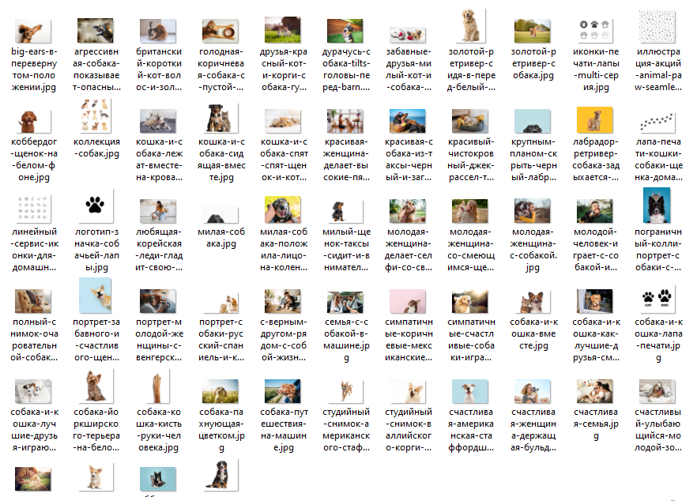

# image_crawler
Модуль для парсинга изображений с веб-страниц и сохранения их локально.


### Описание:
Модуль позволяет извлекать и скачивать изображения с веб-страниц по заданным ключевым словам и количеству страниц. Для этого используются запросы к веб-страницам и парсинг HTML с помощью библиотек requests и BeautifulSoup.

### Функции:

- `download_images` - основная функция для скачивания изображений. Принимает путь к директории, ключевое слово для поиска и количество страниц.
- `save_image` - функция для сохранения изображения в заданную директорию.
- `get_imgs_from_page` - функция для извлечения изображений с веб-страницы.
- `get_images` - функция для получения списка изображений из нескольких страниц.


### Использование:
```python
from photo_downloader import ImagesDownloader

path = r'C:\Users\xxx\Projects\BS4\imgs'
result = ImagesDownloader.download_images(path, 'name_download', 1)
```

